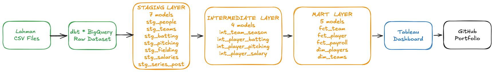
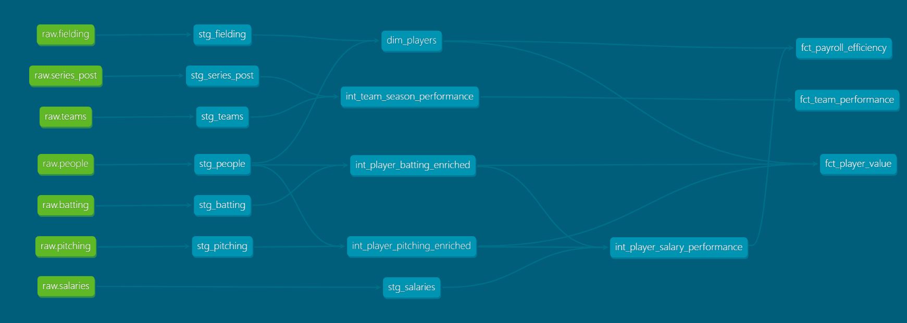

# MLB Operations Intelligence Platform

> End-to-end analytics engineering project transforming 150 years of MLB data 
> into a dimensional warehouse and executive dashboard. Answering three questions 
> every resource-constrained organization asks: what drives performance, where is 
> investment generating the highest return, and what should leadership monitor.

---

## Live Dashboard

**[View on Tableau Public →](https://public.tableau.com/app/profile/amanda.huang2687/viz/mlb_analysis_E/MLBExecutiveMonitoring)**

---

## Business Problem

MLB front offices operate under the same constraints as any business: limited 
budget, competing investments, and pressure to produce results. A GM with a 
$150M payroll must decide how to allocate across 26 roster spots — wrong 
investments mean missed playoffs, wrong monitoring means problems surface too 
late to fix.

This project builds a clean analytical foundation that turns raw statistical 
tables into a single source of truth for three executive questions:

| Question | Business Frame | Dashboard |
|---|---|---|
| Q1 — Performance Drivers | What operational metrics drive winning? | Performance Driver Analysis |
| Q2 — Payroll Efficiency | Which investments generate the highest return? | Payroll Efficiency |
| Q3 — Organizational Health | Which metrics should leadership monitor? | Executive Monitoring Framework |

---

## Architecture



**Stack:** dbt · BigQuery · Tableau Public · Python · SQL

**Data Source:** [Lahman Baseball Database](https://www.seanlahman.com/baseball-archive/statistics/) 
— 150+ years of MLB data across 7 normalized tables

---

## Data Model (dbt DAG)



### Layer Structure

**Staging (7 models)** — Rename columns, cast types, filter nulls. 
No business logic. One model per source table.

**Intermediate (4 models)** — Business logic and joins across entities.
Stint aggregation, OPS calculation, salary-performance joins.

**Marts (5 models)** — Executive-ready tables powering Tableau directly.

| Model | Grain | Powers |
|---|---|---|
| `fct_team_performance` | Team × Season | Q1 Dashboard |
| `fct_player_value` | Player × Season | Player comparison |
| `fct_payroll_efficiency` | Player × Season (1985-2016) | Q2 Dashboard |
| `dim_players` | Player (career) | All dashboards |
| `dim_teams` | Team × Season | All dashboards |

---

## Key Findings & Business Implications

### Q1 — Performance Drivers

**TL;DR**

- ERA is the strongest predictor of win percentage across all eras
- Teams with elite pitching (ERA ≤ 3.80) reach the postseason at 2x the rate 
  of teams with average pitching regardless of offensive output
- Run differential is a more reliable predictor of sustained success than 
  win percentage alone
  
**What Actually Drives Winning?** -> Implication: Where should a GM direct marginal investment?

Pitching quality (ERA) shows a stronger negative correlation with win percentage 
than offensive output across the entire 1985-2016 window. Teams in the bottom 
ERA quartile reached the postseason at roughly half the rate of teams in the 
top ERA quartile — regardless of how many runs they scored.

**Business decision this supports:** When allocating a fixed payroll budget 
between pitching and offense, the data consistently favors pitching investment 
as the higher-leverage decision. A team that improves ERA by 0.5 runs gains 
more expected wins than an equivalent dollar investment in offensive production.

Run differential emerged as a more reliable predictor of sustained success than 
win percentage alone — teams with strong run differentials but below-.500 records 
tend to outperform the following season, while teams with weak run differentials 
despite winning records tend to regress.

**Business decision this supports:** Front offices should monitor run differential 
as a leading indicator of true team quality, not just the standings. This metric 
belongs on every GM's weekly dashboard.


### Q2 — Payroll Efficiency

**TL;DR**

- Pre-arbitration players on rookie contracts dominate value rankings — 
  the top 20 efficiency scorers average under $500K salary
- No consistent correlation between total payroll and win percentage — 
  efficient roster construction outperforms raw spending
- Dominican Republic and Venezuela produce the highest efficiency scores 
  among countries with 50+ players in the dataset

**Q2 — Where Does Payroll Generate the Highest Return?** -> Implication: How should a front office structure its roster investment strategy?

Total payroll shows a weak correlation with win percentage across the dataset. 
Several sub-$60M payroll teams outperformed $100M+ rosters in the same season — 
confirming that roster construction efficiency matters more than raw spending.

- **Business decision this supports:** The highest-ROI roster strategy concentrates 
payroll on 3-4 proven contributors while filling remaining spots with pre-arbitration 
players on league-minimum contracts. The top efficiency scorers in this dataset 
almost universally fall into the latter category — high OPS or low ERA combined 
with sub-$500K salaries.

Position-level salary analysis reveals systematic market inefficiencies. Certain 
positions command premium salaries that are not proportionally reflected in 
efficiency output — representing capital that could be reallocated toward 
higher-leverage roster needs.

- **Business decision this supports:** A GM using position-level efficiency data 
can identify where the market is overpricing talent and avoid those contracts — 
the same analytical edge the 2002 Oakland Athletics exploited before it became 
mainstream.

International scouting shows measurable ROI differences by country of origin. 
Countries with deep baseball development infrastructure consistently produce 
players with higher performance-per-dollar ratios — particularly relevant for 
teams with international bonus pool constraints.

- **Business decision this supports:** Concentrating international scouting 
resources in high-efficiency markets produces better expected returns than 
spreading the budget evenly across all regions.

### Q3 — Organizational Health

**TL;DR**

- St. Louis Cardinals and San Francisco Giants show the highest composite 
  health scores sustained over the 2006-2016 window
- Tampa Bay Rays demonstrate the clearest Moneyball profile — 
  above-average health score despite below-average payroll
- No team in the dataset sustained high win percentage with deteriorating 
  underlying metrics for more than 2 consecutive seasons

**What Should Leadership Monitor Weekly?** -> Implication: What is the minimum viable set of metrics for franchise health?*

The composite organizational health score — weighting win percentage, ERA 
efficiency, run production, and postseason appearances — reveals that sustained 
winning is not accidental. Franchises with consistently high health scores 
maintain competitive windows 3-4 years longer than franchises that optimize 
for a single season.

- **Business decision this supports:** Ownership evaluating a GM's performance 
should track health score trajectory, not just current record. A franchise with 
an improving health score and a losing record is executing a sound rebuild. 
A franchise with a declining health score and a winning record is mortgaging 
its future.

The data shows no franchise in the 2006-2016 window sustained high win 
percentage with deteriorating underlying metrics beyond two consecutive seasons. 
Regression is predictable — and preventable with early indicator monitoring.

- **Business decision this supports:** The six metrics that belong on every 
executive dashboard are: ERA, run differential, payroll efficiency score, 
health score trend, postseason appearances per 5-year window, and pre-arbitration 
player contribution percentage. These leading indicators give a GM 12-18 months 
of advance warning before problems appear in the standings.

## Modeling Decisions

### Player Value Proxy
The Lahman database does not include WAR because WAR requires play-by-play 
data not available in season-aggregate tables. Rather than abandoning the 
payroll efficiency question, I defined documented proxies:

- **Batters:** OPS (On-base Plus Slugging) — captures both contact and power
- **Pitchers:** K/9 ÷ BB/9 × (1/ERA) — isolates pitcher control from fielding

These metrics are documented explicitly in dbt model descriptions so any 
analyst consuming the mart tables understands what the metric is and is not.

### Stint Aggregation
Players traded mid-season appear as multiple rows in the Lahman batting and 
pitching tables (one per team). All intermediate models aggregate counting 
stats to one row per player per season before joining to salary data.

### Era Scoping
`fct_team_performance` is scoped to 1985-present to align with salary data 
availability. Full historical data remains accessible in staging and 
intermediate layers.

---

## Data Limitations

- **No WAR** — season aggregates only; OPS and ERA proxies used and documented
- **Salary data ends 2016** — Lahman public dataset limitation; 
  production version would pipe current data from Baseball Reference or Spotrac
- **No pitch-level or game-level granularity** — season totals only
- **Position approximation** — primary position derived from games played 
  at each position; multi-position players may be miscategorized

---

## Data Quality

- 44 dbt tests across all layers (18 staging + 26 mart)
- Tests cover: not_null, unique, accepted_values on all key columns
- All tests passing: PASS=44 WARN=0 ERROR=0

---

## How to Run

### Prerequisites
- Python 3.10+
- Google Cloud account with BigQuery enabled
- dbt-bigquery (`pip install dbt-bigquery`)

### Setup
```bash
# Clone the repo
git clone https://github.com/amandahuang3/mlb-operations-intelligence.git
cd mlb-operations-intelligence

# Install dbt
pip install dbt-bigquery

# Configure your BigQuery connection
dbt init mlb_analytics

# Run all models
dbt run

# Run all tests
dbt test

# Generate documentation
dbt docs generate
dbt docs serve
```

### Data Loading
Download Lahman CSV files from [seanlahman.com](https://www.seanlahman.com) 
and run the provided `load_to_bigquery.py` script with your GCP project ID.

---

## Tech Stack

| Tool | Purpose |
|---|---|
| dbt | Data transformation, testing, documentation |
| BigQuery | Cloud data warehouse |
| Tableau Public | Executive dashboard |
| Python | BigQuery data loading |
| SQL | All transformation logic |
| Git + GitHub | Version control + portfolio hosting |
